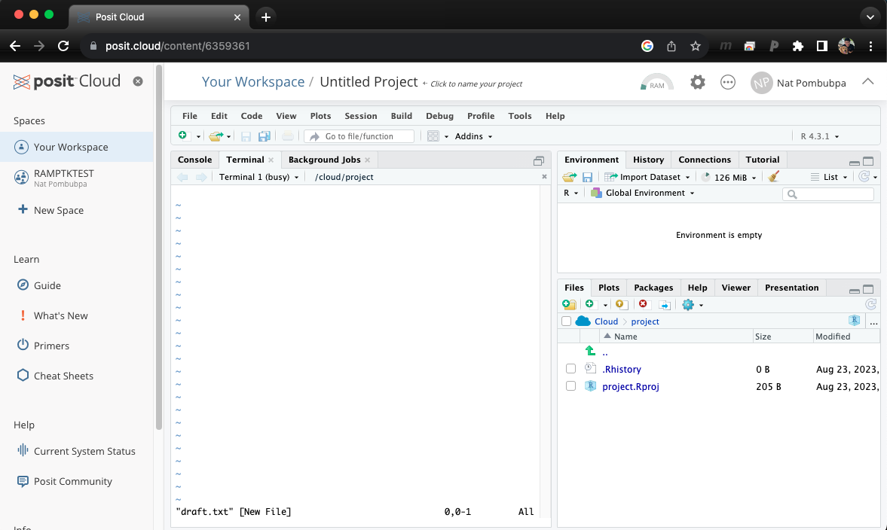

Basic Unix for Biologists is aiming to helps anyone who would like to learn basic unix programming. This introduction/tutorial dose not require installation, you can simply click you can simply use [Rstudio Cloud](https://login.rstudio.cloud/) on your browser. Basic Unix for Biologists (EP1) will show you how this tutorial is setup and also introduce you to unix shell programming which will prepare you for Basic Unix for Biologists (EP2.)


เว็บเพจนี้สอน Unix Shell เบื้องต้น โดยผู้เรียนไม่ต้องดาวน์โหลดโปรแกรมลงบนคอมพิวเตอร์ส่วนตัว เพียงใช้ [Rstudio Cloud](https://login.rstudio.cloud/) บนเว็บบราวเชอร์ Basic Unix for Biologists (ตอนที่ 1) จะเริ่มต้นกล่าวถึงองค์ประกอบของข้อมูลที่จะใช้ในการเรียน Basic Unix for Biologists และแนะนำเกี่ยวกับ Unix Shell เบื้องต้น เพื่อเตรียมความพร้อมสำหรับ Basic Unix for Biologists (ตอนที่ 2)

<style>
pre {
  font-family: Consolas,"courier new";
  width: 1188px;
  color: lightgreen;
  float: left;
  background-color: #0a0101;
  padding: 18px;
  font-size: 100%;
}
</style>


## Step A: Open Rstudio cloud and Launch Terminal

{:class="img-responsive"}

Once you log in to Rstudio cloud, your web browser should bring up a similar window as the picture shown above. Click the button on the top right corner to create a new Rstudio project. Then, the next step is to click "Terminal" which should look like a picture below after you click on it.

{:class="img-responsive"}


Download example files 

{:.left}
```bash

/cloud/project$ git clone https://github.com/NatPombubpa/Binder_Intro_Unix.git

```

If everything work perfectly for you, you are ready for the tutorial. 

## What can a computer do simple term?
Naigate files, run programs/applications, store data, interact with users etc.
- Graphical user interface (GUI): users can see files, folders, etc. graphically (on the left of your binder)
- Command-line interdaces (CLI): users interact with computer via command line (Terminal on the right of your binder)

If we are using GUI with too many clicks, we can use CLI to help us. 

### Unix concept 1: Navigating files
To find out where we are, we can use ```pwd``` to print out current working directory.

{:.left}
```bash

/cloud/project$ pwd
/cloud/project

```

Check files in the current directory (current folder) using ```ls``` command (listing). You should have four items in your current directory as shown below. 

{:.left}
```bash

/cloud/project$ ls
Binder_Intro_Unix  project.Rproj

```

If you want to annotate folders when using ```ls``` command, we can use a flag ```ls -F``` is listing with flag-F to indicate directory/folder.

{:.left}
```bash

/cloud/project$ ls -F
Binder_Intro_Unix/  project.Rproj

```

**Practice question 1:** What does the command ```ls``` do when using with ```-l``` and ```-h``` flags?


Check files in other directory using ```ls Directory_name```, you will see that there are four items in ```Binder_Intro_Unix``` folder.

{:.left}
```bash

/cloud/project$ ls Binder_Intro_Unix/
README.md  apt.txt  data-shell  unix_intro

```

Now, we know which directory we want to work with, let's change working directory using ```cd``` command.

{:.left}
```bash

/cloud/project$ cd Binder_Intro_Unix/
/cloud/project/Binder_Intro_Unix$ 

```

Now we know how to go down directory, how do we go up/back?

{:.left}
```bash

/cloud/project/Binder_Intro_Unix$ cd project
bash: cd: project: No such file or directory

```
To take us back to parent directory, we do ```cd ..```, let's try

{:.left}
```bash

/cloud/project/Binder_Intro_Unix$ cd ..
/cloud/project$ 

```

We can also use a path to change directory.

{:.left}
```bash

/cloud/project$ cd Binder_Intro_Unix/unix_intro/experiment/
/cloud/project/Binder_Intro_Unix/unix_intro/experiment$ 

```


### Unix concept 2: Working with files
We know how to navigate files, how can we create, copy, or delete files? 
Let's make sure we start at ```unix_intro``` folder and take a look at what we have in this folder using ```ls -F```.

{:.left}
```bash

/cloud/project$ cd Binder_Intro_Unix/unix_intro/
/cloud/project/Binder_Intro_Unix/unix_intro$ pwd
/cloud/project/Binder_Intro_Unix/unix_intro
/cloud/project/Binder_Intro_Unix/unix_intro$ ls -F
data/  example.txt  experiment/  six_commands/

```

Currently, there are three directories/folders, to create a new directory, we will use ```mkdir``` command.

{:.left}
```bash
/cloud/project/Binder_Intro_Unix/unix_intro$ mkdir Thesis
```

Check if you have ```Thesis``` directory, there should be five items in your ```unix_intro``` directory.

{:.left}
```bash
/cloud/project/Binder_Intro_Unix/unix_intro$ ls -F
data/  example.txt  experiment/  six_commands/  Thesis/
```

Note for naming files and directiries: 1) don't use whitespaces, 2) don't begin with ```-``` (dash), 3) stick with letters, numbers, ```.``` (period or full stop), ```-``` (dash), and ```_``` (underscore). [Referent to swcarpentry](swcarpentry.github.io)


Now, change working directory to ```Thesis``` and we will create a file called ```draft.txt``` using ```vim``` command.

{:.left}
```bash

/cloud/project/Binder_Intro_Unix/unix_intro$ cd Thesis/
/cloud/project/Binder_Intro_Unix/unix_intro/Thesis$ vim draft.txt

```

Once you open up ```vim``` it will look like a picture below. Let's write a sentence into your file. Press ```i``` to activate insert mode, then press ```esc``` to exit after you're done writing. To save file, type ```:w``` and press enter. To exit from ```vim```, type ```:q``` and press enter.

{:class="img-responsive"}

Check for ```draft.txt``` in your ```Thesis``` directory

{:.left}
```bash

/cloud/project/Binder_Intro_Unix/unix_intro/Thesis$ ls -lh
total 4.0K
-rw-rw---- 1 r2039697 rstudio-user 17 Sep 18 02:28 draft.txt

```

Create a file without text editor using ```touch``` command, let's try

{:.left}
```bash

/cloud/project/Binder_Intro_Unix/unix_intro/Thesis$ touch my_file.txt

```

**Practice question 2:** What did the touch command do? When you look at your home directory using the GUI file explorer, does the file show up?

**Preactice question 3:** Try using ```ls -l``` to inpsec the files, do you see any different between ```draft.txt``` and ```my_file.txt```?


We know how to create a file, how do we delete/remove file?
We cab use ```rm``` command, however, there is no trash bin. Removing/deleting is FOREVER!!! Be Careful!!!

{:.left}
```bash
/cloud/project/Binder_Intro_Unix/unix_intro/Thesis$ rm draft.txt 
```

What about removing directory? Let's move up/back to ```unix_intro``` and try removing ```Thesis``` directory

{:.left}
```bash
/cloud/project/Binder_Intro_Unix/unix_intro/Thesis$ cd ..
/cloud/project/Binder_Intro_Unix/unix_intro$ rm Thesis/
rm: cannot remove 'Thesis/': Is a directory
```

You will get an error. To remove directory, we can use ```rm -r Thesis``` and your ```Thesis``` will be removed.

{:.left}
```bash
/cloud/project/Binder_Intro_Unix/unix_intro$ rm -r Thesis/
```

How do we change file name? We can use ```mv``` command.

{:.left}
```bash
#lisitng files and folder
/cloud/project/Binder_Intro_Unix/unix_intro$ ls
data  example.txt  experiment  six_commands

#change file name using mv command
/cloud/project/Binder_Intro_Unix/unix_intro$ mv example.txt example_1.txt 

#listing files and folder, you should see that example.txt becomes example_1.txt
/cloud/project/Binder_Intro_Unix/unix_intro$ ls
data  example_1.txt  experiment  six_commands
```

We can also use ```mv``` command to move file.

{:.left}
```bash
# move a file
/cloud/project/Binder_Intro_Unix/unix_intro$ mv example_1.txt data/

# now a file has been moved to data folder
/cloud/project/Binder_Intro_Unix/unix_intro$ ls data/
all_samples  example_1.txt

```

How about copy file instead if moving file?

{:.left}
```bash
#copy file to current directory
/cloud/project/Binder_Intro_Unix/unix_intro$ cp data/example_1.txt .

#listing files and folders, example_1.txt should be present in your current working directory
/cloud/project/Binder_Intro_Unix/unix_intro$ ls
data  example_1.txt  experiment  six_commands
```

**Practice question 4:** Suppose that you created a ```.txt``` file in your current directory to contain a list of the statistical tests you will need to analyze your data, and named it: ```statstics.txt```
After creating and saving this file you realize you misspelled the filename! You want to correct the mistake, which of the following commands could you use to do so? Please explain why?
1. ```cp statstics.txt statistics.txt```
2. ```mv statstics.txt statistics.txt```
3. ```mv statstics.txt .```
4. ```cp statstics.txt .```


Lastly, there are many useful commands that were not covered in this tutorial, but I hope that this tutorial and system will make you feel more comfortable using CLI. 


References
- [The Unix Shell Introduction](https://swcarpentry.github.io/shell-novice/)
- [Computational Analysis of High Throughput Biological Data](https://biodataprog.github.io/programming-intro/)
- [Happy Belly Bioinformatics](https://astrobiomike.github.io/)
