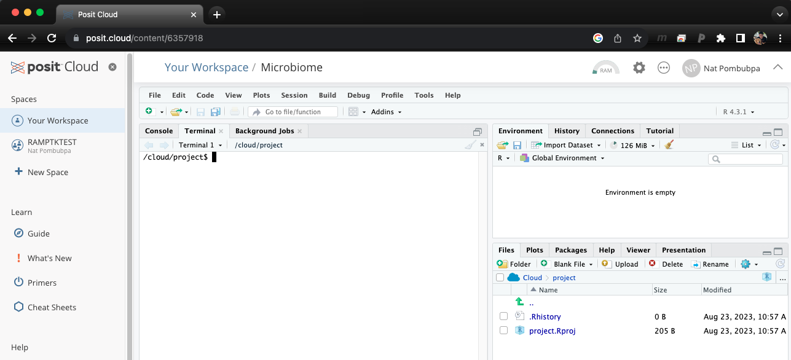

Basic Unix for Biologists EP2 is aiming to helps anyone who would like to learn basic unix programming. This introduction/tutorial dose not require installation, you can simply click you can simply use [Rstudio Cloud](https://login.rstudio.cloud/) on your browser. 


เว็บเพจนี้สอน Unix Shell เบื้องต้น โดยผู้เรียนไม่ต้องดาวน์โหลดโปรแกรมลงบนคอมพิวเตอร์ส่วนตัว เพียงใช้ [Rstudio Cloud](https://login.rstudio.cloud/) บนเว็บบราวเชอร์ 

<style>
pre {
  font-family: Consolas,"courier new";
  width: 1188px;
  color: lightgreen;
  float: left;
  background-color: #0a0101;
  padding: 18px;
  font-size: 100%;
}
</style>

## Open Binder and Launch Terminal

## Step A: Open Rstudio cloud and Launch Terminal

{:class="img-responsive"}

Once you log in to Rstudio cloud, your web browser should bring up a similar window as the picture shown above. Click the button on the top right corner to create a new Rstudio project. Then, the next step is to click "Terminal" which should look like a picture below after you click on it.

{:class="img-responsive"}


Download example files (If you have done this for EP1, you can skip this part.)

{:.left}
```bash

/cloud/project$ svn export https://github.com/NatPombubpa/Binder_Intro_Unix/trunk/unix_intro
/cloud/project$ svn export https://github.com/NatPombubpa/Binder_Intro_Unix/trunk/data-shell

```

If everything work perfectly for you, you are ready for the tutorial. 

## Very useful commands
We will learn some useful commands that are used ofetn in Bioinformatics.

{:.left}
```bash

/cloud/project$ cd ~/unix_intro/six_commands/

```

We'll be working with ```gene_annotations.tsv``` which contains information including ```gene_ID```, ```genome```, ```KO_ID```, and ```KO_annotation``` (KO is Kegg Orthology - functional database).

Let's checkout the file

{:.left}
```bash

/cloud/project$ head gene_annotations.tsv

```

Let's take a look at the first few lines

{:.left}
```bash

/cloud/project$ head -n 3 gene_annotations.tsv

```

We can also count number of rows in the file

{:.left}
```bash

/cloud/project$ wc -l gene_annotations.tsv

```

## cut command

using cut to extract column from tab delimted file

{:.left}
```bash

/cloud/project$ cut -f 1 gene_annotations.tsv

```

cut and print out just few lines

{:.left}
```bash

/cloud/project$ cut -f 1 gene_annotations.tsv | head

```

{:.left}
```bash

/cloud/project$ cut -f 1,3 gene_annotations.tsv | head

```

{:.left}
```bash

/cloud/project$ cut -f 1-3 gene_annotations.tsv | head

```

However, it we use other types of file, we might have to add a delimiter.

{:.left}
```bash

/cloud/project$ cut -d "," -f 1-3 example_gene_annotations.csv | head

```

### cut command practice
Create a new file that contian 2 columns including gene_ID and KO_annotation. Hint: ```>``` is a redirector.

## grep command
grep = global regular expression
grep can be used to search through a text file and print out the match.

{:.left}
```bash

/cloud/project$ grep re colors.txt

```

let's imagine we're looking for genes that are predicted to encode the enzyme epoxyqueuosine reductase. When we search for this on the [KO website](https://www.genome.jp/kegg/ko.html), we find two KO_IDs linked with it: K09765 and K18979. use grp to find these IDs

{:.left}
```bash

/cloud/project$ grep K09765 gene_annotations.tsv

```

{:.left}
```bash

/cloud/project$ grep K18979 gene_annotations.tsv

```

To report how mant lines match the pattern, we can add ```-c``` flag

{:.left}
```bash

/cloud/project$ grep -c K18979 gene_annotations.tsv

```

### grep command practice
using ```grep``` and ```cut``` to print out just column 2 (genomes) that have ```K18979``` annotation. Hint: ```|``` is a redirector.

References
- [The Unix Shell Introduction](https://swcarpentry.github.io/shell-novice/)
- [Computational Analysis of High Throughput Biological Data](https://biodataprog.github.io/programming-intro/)
- [Happy Belly Bioinformatics](https://astrobiomike.github.io/)
