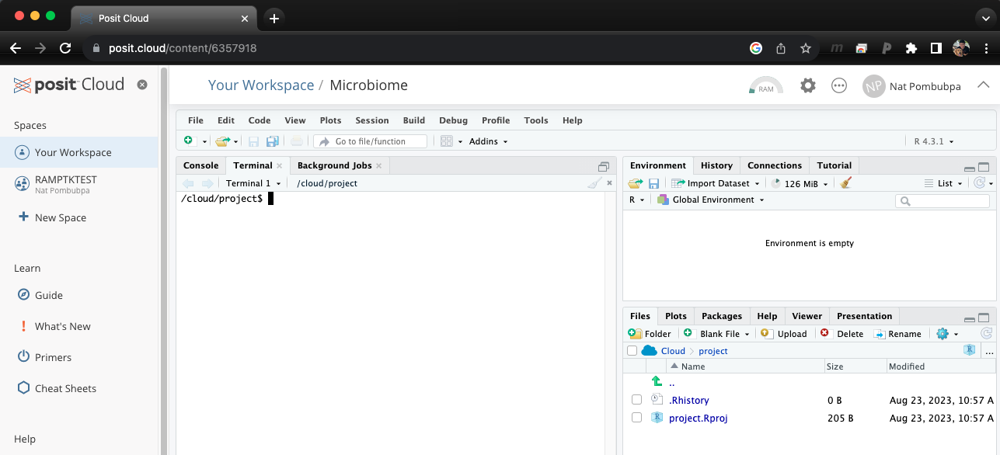

# Fungi functional guild (FunGuild) analysis

This is a basic Fungi functional guild (FUNGuild) analysis tutorial. This tutorial dose not require installation, you can simply use [Rstudio Cloud](https://login.rstudio.cloud/) on your browser.


เว็บเพจนี้สอนวิธีการวิเคราะห์ข้อมูล Fungi functional guild (FUNGuild) เบื้องต้น โดยผู้เรียนไม่ต้องดาวน์โหลดโปรแกรมลงบนคอมพิวเตอร์ส่วนตัว เเพียงใช้ [Rstudio Cloud](https://login.rstudio.cloud/)

<style>
pre {
  font-family: Consolas,"courier new";
  width: 1188px;
  color: lightgreen;
  float: left;
  background-color: #0a0101;
  padding: 18px;
  font-size: 100%;
}
</style>

[FUNGuild](https://www.sciencedirect.com/science/article/pii/S1754504815000847): An open annotation tool for parsing fungal community datasets by ecological guild. 

Once we identify fungal taxonomy/species, the next step that would be crucial for microbial ecology is to learn about fungal ecologyical functions. Our example data were generated using [FUNGuild](https://www.sciencedirect.com/science/article/pii/S1754504815000847) which annotate fungal function to each species in our dataset. Today, we will learn how to perform FUNGuild analysis.

## Step A: Open Rstudio cloud and Launch Terminal

{:class="img-responsive"}

Once you log in to Rstudio cloud, your web browser should bring up a similar window as the picture shown above. Click the button on the top right corner to create a new Rstudio project. Then, the next step is to click "Terminal" which should look like a picture below after you click on it.

{:class="img-responsive"}

## Step B: Miniconda set up

{:.left}
```bash
# download and install miniconda3 to Rstudio cloud

/cloud/project$ wget https://repo.anaconda.com/miniconda/Miniconda3-latest-Linux-x86_64.sh
/cloud/project$ bash Miniconda3-latest-Linux-x86_64.sh
```

Check conda installation 

{:.left}
```bash
/cloud/project$ conda env list

```

{:.left}
```bash
# If there's any issue, try this

/cloud/project$ source ~/.bashrc

```

If everything work perfectly for you, you are almost ready for the actual analysis. 

## Step 1: Download FunGuild program

Using ```git clone``` to download FunGuild

{:.left}
```bash

#Download FUNGuild 
/cloud/project$ git clone https://github.com/UMNFuN/FUNGuild

```

Then, press enter to start downloading process

{:.left}
```bash

#Download FUNGuild 
/cloud/project$ git clone https://github.com/UMNFuN/FUNGuild
Cloning into 'FUNGuild'...
remote: Enumerating objects: 501, done.
remote: Counting objects: 100% (41/41), done.
remote: Compressing objects: 100% (31/31), done.
remote: Total 501 (delta 20), reused 24 (delta 9), pack-reused 460
Receiving objects: 100% (501/501), 1.05 MiB | 7.15 MiB/s, done.
Resolving deltas: 100% (290/290), done.

```

When this step completes, FUNGuild folder should appear. Using ```ls``` command to see your folder.

{:.left}
```bash

/cloud/project$ ls
FUNGuild  project.Rproj

```

We will start with example data in FUNGuild folder. Change directory to FUNGuild folder and check your working directory. It should be ```/cloud/project/FUNGuild```

{:.left}
```bash

/cloud/project$ cd FUNGuild/
/cloud/project/FUNGuild$ pwd
/cloud/project/FUNGuild

```

Let's check what we have in FUNGuild folder using ```ls``` command

{:.left}
```bash

(base) /cloud/project/FUNGuild$ ls
Guilds_v1.1.py                     README.md   example
Miniconda3-latest-Linux-x86_64.sh  deprecated

```

## Step 2: Now, let's perform FUNGuild annotation

{:.left}
```bash

/cloud/project/FUNGuild$ python Guilds_v1.1.py -otu example/otu_table.txt -db fungi

```

Then, press enter. At the end of this process we will have a taxonomy table for the actual FUNGuild annotation

{:.left}
```bash

/cloud/project/FUNGuild$ python Guilds_v1.1.py -otu example/otu_table.txt -db fungi
FunGuild v1.1 Beta
Connecting with FUNGuild database ...

Reading in the OTU table: 'example/otu_table.txt'

```

At the end of this process we will have a FUNGuild table.


### Let's take a look at our fungi functional guild results

{:.left}
```bash

[/cloud/project/FUNGuild]$ awk '{print $1" "$10}' example/otu_table.guilds.txt 
OTU trophicMode
OTU_100 Pathotroph
OTU_1002 Symbiotroph
OTU_1003 na
OTU_1008 Saprotroph-Symbiotroph
OTU_1011 Symbiotroph
OTU_1015 na
OTU_1018 na
OTU_1021 Pathotroph-Saprotroph
OTU_1023 Symbiotroph
OTU_1024 na

```
