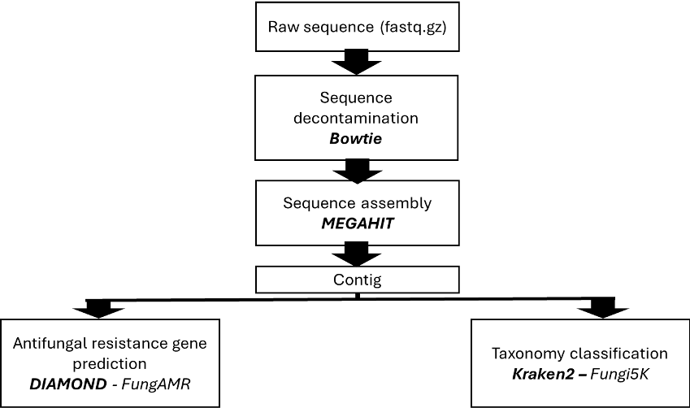
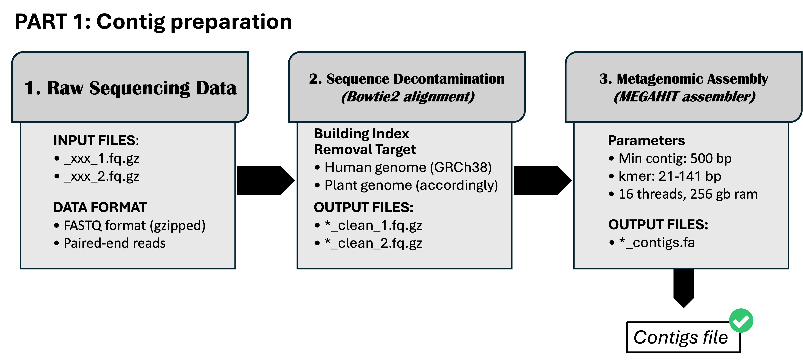
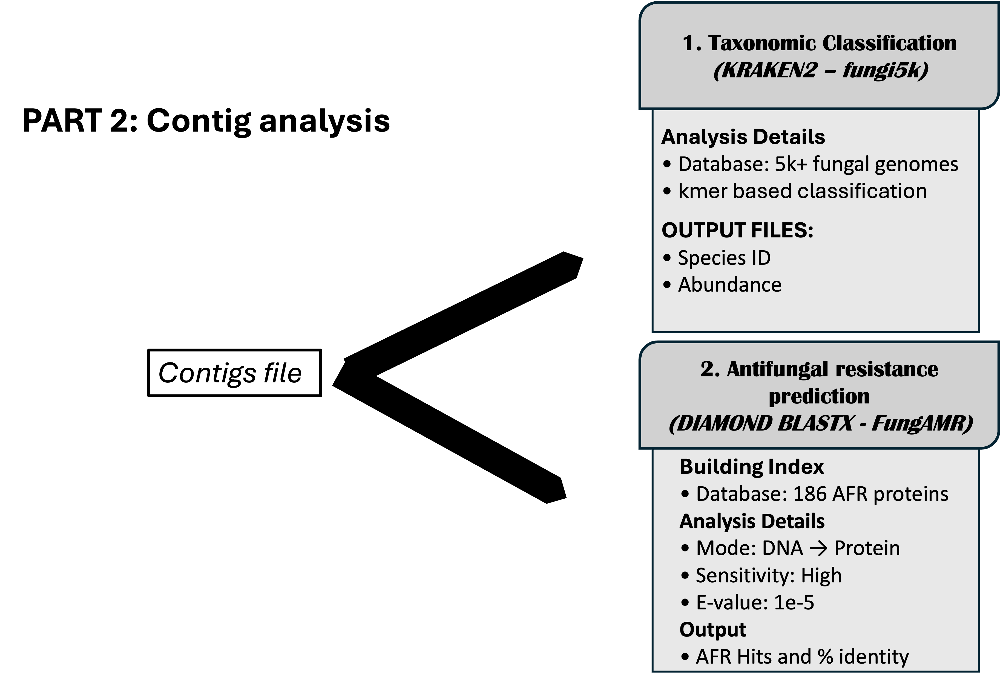
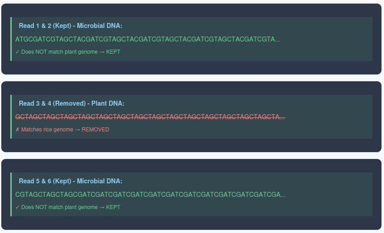
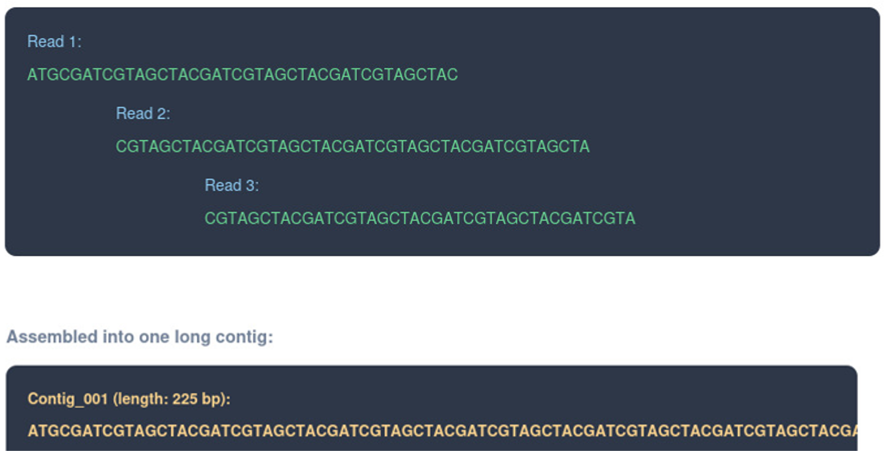

# Metagenomics preprocessing (Data curation and analysis)

Metagenomics preprocessing refers to the initial computational steps applied to raw sequencing data to ensure data quality, consistency, and analytical readiness before downstream analyses. This stage focuses on data curation and primary analysis, aiming to minimize technical noise while preserving biologically relevant signals.

▶️ Watch: [Metagenomics preprocessing Tutorial](https://www.youtube.com/watch?v=WnICYdNGXxg)
📁 Drive: [Training materials](https://drive.google.com/drive/folders/1Y9rFzn6YoM4xVY5_Cp0dVZ5IB1CqssrK?usp=drive_link)

<style>
pre {
  font-family: Consolas,"courier new";
  width: 1188px;
  color: lightgreen;
  float: left;
  background-color: #0a0101;
  padding: 18px;
  font-size: 100%;
}
</style>

## A: What is Pipeline ?
“A bioinformatics pipeline is a set of complex algorithms (tools), which is used to process sequence data”

{:class="img-responsive"}

This stage includes quality assessment, removal of low-quality reads and artifacts, adapter trimming, contaminant or host filtering, and metadata standardization, followed by basic normalization and preliminary taxonomic or functional profiling to validate data integrity and inform subsequent analyses.

## A: Pipeline overview
Pipeline part 1: Contig preparation

{:class="img-responsive"}

Pipeline part 2: Contigs analysis

{:class="img-responsive"}

## B: HPCC and Shell script
HPCC (High-Performance Computing Cluster) is an open-source, data-intensive computing platform for processing and analyzing massive, complex datasets.

The HPCC platform incorporates a software architecture implemented on commodity computing clusters to provide high-performance, data-parallel processing for applications utilizing big data.

What is Shell?
A shell is special user program which provide an interfae to user to use operating system services. Shell accept human readable commands from user and convert them into something which kernel can understand. The shell gets started when the user logs in or start the terminal.

## C: Details on Script (Pipeline part 1)
The script will be as .sh extension which is a shell script. It is a plain text file that contains a sequence of commands that are executed by a Unix shell, which is a command-line interpreter. 


Called as “shebang” or Run this script using the Bash shell

{:.left}
```bash
#!/bin/bash
#SBATCH --job-name=decontam_assembly_CO884
#SBATCH --output=decontam_assembly_CO884_%j.out
#SBATCH --error=decontam_assembly_CO884_%j.err
#SBATCH --time=48:00:00
#SBATCH --ntasks=16
#SBATCH --mem=256G
#SBATCH --array=1-3
```

Load module that is prepared in HPCC system

{:.left}
```bash
# Load required modules
module load bowtie2
module load megahit
```

Configure where are the directory for the analysis located

{:.left}
```bash
# Configuration
INPUT_DIR="/bigdata/pombubpalab/shared/FAILSAFE/training_feb2026/sequence"
WORK_DIR="/bigdata/pombubpalab/shared/FAILSAFE/training_feb2026/processed"
CLEAN_READS_DIR="/bigdata/pombubpalab/shared/FAILSAFE/training_feb2026/clean_reads"
ASSEMBLY_DIR="/bigdata/pombubpalab/shared/FAILSAFE/training_feb2026/assembly_results"
GENOME_DIR="/bigdata/pombubpalab/shared/FAILSAFE/Metagenome/BowtieIndices"
ASSEMBLER="megahit"  # Options: "megahit" or "metaspades"
```

Sample array or what is the name of the sample file

{:.left}
```bash
# Sample array
SAMPLES=(
    "Unknown_CO884-001R0001"
    "Unknown_CO884-001R0002"
    "Unknown_CO884-001R0003"
)
```

Decontamination explanation

{:class="img-responsive"}

Assembly explanation

{:class="img-responsive"}

## C: Details on Script (Pipeline part 2)

{:.left}
```bash
#!/bin/bash
#SBATCH --job-name=AFR_search_training
#SBATCH --output=AFR_search_training_%j.out
#SBATCH --error=AFR_search_training_%j.err
#SBATCH --time=4:00:00
#SBATCH --cpus-per-task=8
#SBATCH --mem=64G
#SBATCH --array=1-3

################################################################################
# Antifungal Resistance Gene Search using DIAMOND
# Training Samples (CO884) - Feb 2026
################################################################################

echo "================================================================================"
echo "Antifungal Resistance Gene Search - DIAMOND BLASTX"
echo "Training Samples (CO884)"
echo "================================================================================"
echo "Job ID: $SLURM_JOB_ID"
echo "Array Task ID: $SLURM_ARRAY_TASK_ID"
echo "Start time: $(date)"
echo "Node: $(hostname)"
echo "================================================================================"
echo ""

################################################################################
# CONFIGURATION
################################################################################

# Directories
AFR_DB="/bigdata/pombubpalab/shared/FAILSAFE/Metagenome/AFRdb/antifungal_resistance_db"
ASSEMBLY_DIR="/bigdata/pombubpalab/shared/FAILSAFE/training_feb2026/assembly_results"
OUTPUT_DIR="/bigdata/pombubpalab/shared/FAILSAFE/training_feb2026/AFR_search_results"

# Sample array - Training samples CO884
SAMPLES=(
    "Unknown_CO884-001R0001"
    "Unknown_CO884-001R0002"
    "Unknown_CO884-001R0003"
)

# Get current sample
SAMPLE=${SAMPLES[$SLURM_ARRAY_TASK_ID-1]}

# DIAMOND parameters
THREADS=8
EVALUE="1e-5"
MAX_TARGET_SEQS=10
SENSITIVITY="sensitive"
```


{:.left}
```bash
################################################################################
# LOAD MODULES
################################################################################

echo "Loading DIAMOND module..."
module load diamond/2.1.12
echo ""
```


{:.left}
```bash
################################################################################
# SETUP
################################################################################

# Create output directory for this sample
mkdir -p ${OUTPUT_DIR}/${SAMPLE}
cd ${OUTPUT_DIR}/${SAMPLE}

echo "Processing sample: ${SAMPLE}"
echo ""

# Define assembly file
ASSEMBLY_FILE="${ASSEMBLY_DIR}/${SAMPLE}/${SAMPLE}_contigs.fa"

# Try alternative file locations/names if not found
if [[ ! -f "${ASSEMBLY_FILE}" ]]; then
    ASSEMBLY_FILE="${ASSEMBLY_DIR}/${SAMPLE}.fasta"
fi
if [[ ! -f "${ASSEMBLY_FILE}" ]]; then
    ASSEMBLY_FILE="${ASSEMBLY_DIR}/${SAMPLE}.fa"
fi
if [[ ! -f "${ASSEMBLY_FILE}" ]]; then
    ASSEMBLY_FILE="${ASSEMBLY_DIR}/${SAMPLE}_contigs.fasta"
fi

```


{:.left}
```bash
################################################################################
# VERIFY INPUTS
################################################################################

echo "Checking input files..."

# Check assembly file exists
if [[ ! -f "${ASSEMBLY_FILE}" ]]; then
    echo "✗ ERROR: Assembly file not found: ${ASSEMBLY_FILE}"
    echo ""
    echo "Tried locations:"
    echo "  ${ASSEMBLY_DIR}/${SAMPLE}/${SAMPLE}_contigs.fa"
    echo "  ${ASSEMBLY_DIR}/${SAMPLE}.fasta"
    echo "  ${ASSEMBLY_DIR}/${SAMPLE}.fa"
    echo "  ${ASSEMBLY_DIR}/${SAMPLE}_contigs.fasta"
    exit 1
fi

# Check AFR database exists
if [[ ! -f "${AFR_DB}.dmnd" ]]; then
    echo "✗ ERROR: AFR database not found: ${AFR_DB}.dmnd"
    echo "Please build the database first"
    exit 1
fi

# Count contigs in assembly
NUM_CONTIGS=$(grep -c "^>" "${ASSEMBLY_FILE}" || echo "0")

echo "✓ Input files verified"
echo "  Assembly: ${ASSEMBLY_FILE}"
echo "  Contigs: ${NUM_CONTIGS}"
echo "  AFR Database: ${AFR_DB}.dmnd"
echo "  Threads: ${THREADS}"
echo "  E-value: ${EVALUE}"
echo "  Sensitivity: ${SENSITIVITY}"
echo ""

```


{:.left}
```bash
################################################################################
# RUN DIAMOND SEARCH
################################################################################

echo "================================================================================"
echo "Running DIAMOND BLASTX Search for Antifungal Resistance Genes"
echo "================================================================================"
echo ""

# Output files
OUTPUT_TABULAR="AFR_hits.txt"

# Run DIAMOND BLASTX (nucleotide query -> protein database)
echo "Searching for antifungal resistance genes..."
echo "This may take 10-60 minutes depending on assembly size..."
echo ""

diamond blastx \
    --db "${AFR_DB}" \
    --query "${ASSEMBLY_FILE}" \
    --out "${OUTPUT_TABULAR}" \
    --outfmt 6 qseqid sseqid pident length mismatch gapopen qstart qend sstart send evalue bitscore qlen slen stitle \
    --evalue "${EVALUE}" \
    --max-target-seqs "${MAX_TARGET_SEQS}" \
    --threads "${THREADS}" \
    --${SENSITIVITY}

SEARCH_STATUS=$?

echo ""

```


{:.left}
```bash
################################################################################
# ANALYZE RESULTS
################################################################################

if [ $SEARCH_STATUS -eq 0 ]; then
    echo "================================================================================"
    echo "RESULTS ANALYSIS"
    echo "================================================================================"
    echo ""
    
    if [[ -f "${OUTPUT_TABULAR}" ]] && [[ -s "${OUTPUT_TABULAR}" ]]; then
        # Count hits
        TOTAL_HITS=$(wc -l < "${OUTPUT_TABULAR}")
        CONTIGS_WITH_HITS=$(cut -f1 "${OUTPUT_TABULAR}" | sort -u | wc -l)
        UNIQUE_AFR_GENES=$(cut -f2 "${OUTPUT_TABULAR}" | sort -u | wc -l)
        
        # Calculate percentages
        PERCENT_CONTIGS=$(awk "BEGIN {printf \"%.2f\", (${CONTIGS_WITH_HITS}/${NUM_CONTIGS})*100}")
        
        echo "✓ Search completed successfully!"
        echo ""
        echo "=== ANTIFUNGAL RESISTANCE GENE SEARCH RESULTS ==="
        echo "Sample: ${SAMPLE}"
        echo ""
        echo "Input Statistics:"
        echo "  Total contigs in assembly: ${NUM_CONTIGS}"
        echo ""
        echo "Search Results:"
        echo "  Total AFR gene hits: ${TOTAL_HITS}"
        echo "  Contigs with AFR genes: ${CONTIGS_WITH_HITS} (${PERCENT_CONTIGS}%)"
        echo "  Unique AFR genes detected: ${UNIQUE_AFR_GENES}"
        echo ""
        
        # Identity distribution
        echo "Identity Distribution:"
        awk '{
            if ($3 >= 90) high++;
            else if ($3 >= 70) medium++;
            else if ($3 >= 50) low++;
            else very_low++;
            total++;
        }
        END {
            printf "  90-100%% identity: %d hits (%.1f%%)\n", high+0, 100*high/total;
            printf "  70-89%% identity:  %d hits (%.1f%%)\n", medium+0, 100*medium/total;
            printf "  50-69%% identity:  %d hits (%.1f%%)\n", low+0, 100*low/total;
            printf "  <50%% identity:    %d hits (%.1f%%)\n", very_low+0, 100*very_low/total;
        }' "${OUTPUT_TABULAR}"
        
        echo ""
        echo "Top 10 AFR Genes Detected (by hit count):"
        echo "-----------------------------------------------------------------------"
        cut -f2,15 "${OUTPUT_TABULAR}" | sort | uniq -c | sort -rn | head -10 | \
            awk '{print "  " $1 " hits: " $2 " - " substr($0, index($0,$3))}'
        
        echo ""
        echo "Top 10 Best Hits (by bit score):"
        echo "-----------------------------------------------------------------------"
        sort -k12,12rn "${OUTPUT_TABULAR}" | head -10 | \
            awk '{printf "  Contig: %-20s  Gene: %-15s  Identity: %5.1f%%  E-value: %s\n", $1, $2, $3, $11}'
        
        echo ""
        echo "High-Confidence Hits (>90% identity):"
        echo "-----------------------------------------------------------------------"
        HIGH_CONF=$(awk '$3 > 90' "${OUTPUT_TABULAR}" | wc -l)
        if [ $HIGH_CONF -gt 0 ]; then
            awk '$3 > 90 {printf "  %-20s %-15s %5.1f%% %6dbp E=%-10s %s\n", $1, $2, $3, $4, $11, $15}' "${OUTPUT_TABULAR}" | head -20
            if [ $HIGH_CONF -gt 20 ]; then
                echo "  ... and $((HIGH_CONF - 20)) more high-confidence hits"
            fi
        else
            echo "  No hits with >90% identity"
        fi
        
    else
        echo "⚠ WARNING: No antifungal resistance genes detected in this sample"
        echo ""
        TOTAL_HITS=0
        CONTIGS_WITH_HITS=0
        UNIQUE_AFR_GENES=0
        PERCENT_CONTIGS="0.00"
    fi

```

{:.left}
```bash
   ################################################################################
    # CREATE SUMMARY REPORT
    ################################################################################
    
    echo ""
    echo "Creating summary report..."
    
    cat > ${SAMPLE}_AFR_summary.txt << EOF
===============================================================================
Antifungal Resistance Gene Search Summary
===============================================================================
Sample: ${SAMPLE}
Search Date: $(date)
Database: antifungal_resistance_db (186 protein sequences)

Input:
  Assembly File: ${ASSEMBLY_FILE}
  Total Contigs: ${NUM_CONTIGS}

Search Parameters:
  Mode: DIAMOND BLASTX (DNA -> Protein)
  E-value threshold: ${EVALUE}
  Sensitivity: ${SENSITIVITY}
  Max targets per query: ${MAX_TARGET_SEQS}
  Threads: ${THREADS}

Results:
  Total AFR gene hits: ${TOTAL_HITS}
  Contigs with AFR genes: ${CONTIGS_WITH_HITS} (${PERCENT_CONTIGS}%)
  Unique AFR genes detected: ${UNIQUE_AFR_GENES}

EOF
    
    # Add identity distribution
    echo "Identity Distribution:" >> ${SAMPLE}_AFR_summary.txt
    if [ ${TOTAL_HITS} -gt 0 ]; then
        awk '{
            if ($3 >= 90) high++;
            else if ($3 >= 70) medium++;
            else if ($3 >= 50) low++;
            else very_low++;
            total++;
        }
        END {
            printf "  90-100%% identity: %d hits (%.1f%%)\n", high+0, 100*high/total;
            printf "  70-89%% identity:  %d hits (%.1f%%)\n", medium+0, 100*medium/total;
            printf "  50-69%% identity:  %d hits (%.1f%%)\n", low+0, 100*low/total;
            printf "  <50%% identity:    %d hits (%.1f%%)\n", very_low+0, 100*very_low/total;
        }' "${OUTPUT_TABULAR}" >> ${SAMPLE}_AFR_summary.txt
        
        echo "" >> ${SAMPLE}_AFR_summary.txt
        echo "Top 10 AFR Genes Detected:" >> ${SAMPLE}_AFR_summary.txt
        echo "-----------------------------------------------------------------------" >> ${SAMPLE}_AFR_summary.txt
        cut -f2,15 "${OUTPUT_TABULAR}" | sort | uniq -c | sort -rn | head -10 | \
            awk '{print "  " $1 " hits: " $2 " - " substr($0, index($0,$3))}' >> ${SAMPLE}_AFR_summary.txt
    else
        echo "  No hits found" >> ${SAMPLE}_AFR_summary.txt
    fi
    
    cat >> ${SAMPLE}_AFR_summary.txt << EOF

Output Files:
  AFR_hits.txt - Tabular results (main output)
  ${SAMPLE}_AFR_summary.txt - This summary report

Column Descriptions (AFR_hits.txt):
  1.  qseqid  - Your contig ID
  2.  sseqid  - AFR gene ID (UniProt accession)
  3.  pident  - Percent identity (higher = better)
  4.  length  - Alignment length in amino acids
  5.  mismatch - Number of mismatches
  6.  gapopen - Number of gap openings
  7.  qstart  - Query start position
  8.  qend    - Query end position
  9.  sstart  - Subject start position
  10. send    - Subject end position
  11. evalue  - E-value (lower = more significant)
  12. bitscore - Bit score (higher = better)
  13. qlen    - Query (contig) length
  14. slen    - Subject (AFR gene) length
  15. stitle  - AFR gene description/name

Good Hit Criteria:
  - E-value < 1e-5 (significant)
  - Identity > 70% (high confidence)
  - Identity 50-70% (moderate confidence)

===============================================================================
EOF
    
    echo "✓ Summary report created: ${SAMPLE}_AFR_summary.txt"
    
else
    echo "================================================================================"
    echo "✗ ERROR: DIAMOND search failed (exit code: ${SEARCH_STATUS})"
    echo "================================================================================"
    exit ${SEARCH_STATUS}
fi

```

{:.left}
```bash
################################################################################
# FINAL OUTPUT
################################################################################

echo ""
echo "================================================================================"
echo "SEARCH COMPLETED"
echo "================================================================================"
echo "End time: $(date)"
echo ""
echo "Output directory: ${OUTPUT_DIR}/${SAMPLE}/"
echo ""
if [ ${TOTAL_HITS} -gt 0 ]; then
    echo "✓ Found ${TOTAL_HITS} AFR gene hits in ${CONTIGS_WITH_HITS} contigs"
    echo "  Unique AFR genes: ${UNIQUE_AFR_GENES}"
else
    echo "⚠ No AFR genes detected in this sample"
fi
echo "================================================================================"

```


{:.left}
```bash
#!/bin/bash
#SBATCH --job-name=kraken2_fungi5k_training_contigs
#SBATCH --output=kraken2_fungi5k_training_contigs_%j.out
#SBATCH --error=kraken2_fungi5k_training_contigs_%j.err
#SBATCH --ntasks=1
#SBATCH --cpus-per-task=24
#SBATCH --mem=256G
#SBATCH --time=72:00:00
#SBATCH --partition=batch

# Load Kraken2 module
module load kraken2/2.1.3

# Set paths
DB="/srv/projects/db/kraken2/fungi5k"
INPUT_DIR="/bigdata/pombubpalab/shared/FAILSAFE/training_feb2026/assembly_results"
OUTPUT_DIR="/bigdata/pombubpalab/shared/FAILSAFE/training_feb2026/kraken2_fungi5k_contigs_results"

# Create output directory
mkdir -p ${OUTPUT_DIR}

# Number of threads
THREADS=24

echo "========================================="
echo "Kraken2 Fungi Analysis on Assembled Contigs - Fungi5k Database"
echo "Training Samples (Feb 2026) - Analysis Type: ASSEMBLED CONTIGS"
echo "Database: ${DB} (fungi5k - 5000+ genomes)"
echo "Input directory: ${INPUT_DIR}"
echo "Output directory: ${OUTPUT_DIR}"
echo "Threads: ${THREADS}"
echo "Started at: $(date)"
echo "========================================="

# Array of sample names - Training samples CO884
samples=(
    "Unknown_CO884-001R0001"
    "Unknown_CO884-001R0002"
    "Unknown_CO884-001R0003"
)

# Process each sample
for sample in "${samples[@]}"; do
    echo ""
    echo "Processing ${sample}..."
    echo "Started at: $(date)"
    
    CONTIGS="${INPUT_DIR}/${sample}/${sample}_contigs.fa"
    OUTPUT="${OUTPUT_DIR}/${sample}_fungi5k_contigs.output"
    REPORT="${OUTPUT_DIR}/${sample}_fungi5k_contigs.report"
    UNCLASSIFIED="${OUTPUT_DIR}/${sample}_fungi5k_unclassified_contigs.fa"
    CLASSIFIED="${OUTPUT_DIR}/${sample}_fungi5k_classified_contigs.fa"
    
    # Check if input file exists
    if [[ ! -f "${CONTIGS}" ]]; then
        echo "ERROR: Contigs file not found for ${sample}"
        echo "Expected: ${CONTIGS}"
        continue
    fi
    
    echo "Input contigs: ${CONTIGS}"
    
    # Run Kraken2 on assembled contigs
    kraken2 --db ${DB} \
            --threads ${THREADS} \
            --output ${OUTPUT} \
            --report ${REPORT} \
            --use-names \
            --unclassified-out ${UNCLASSIFIED} \
            --classified-out ${CLASSIFIED} \
            ${CONTIGS}
    
    echo "Finished ${sample} at: $(date)"
    echo "Report saved to: ${REPORT}"
    
    # Compress output files
    echo "Compressing output files..."
    gzip ${CLASSIFIED} 2>/dev/null
    gzip ${UNCLASSIFIED} 2>/dev/null
    
    # Generate contig-level statistics
    if [ -f ${REPORT} ]; then
        echo ""
        echo "Top 10 fungal classifications for ${sample}:"
        echo "Percent | Contigs | Taxon"
        grep -P '\tS\t' ${REPORT} | sort -k1 -nr | head -10 | awk '{printf "%.2f%% | %d | %s\n", $1, $2, $6}'
    fi
done

echo ""
echo "========================================="
echo "All samples processed with Fungi5k database!"
echo "Finished at: $(date)"
echo "Results are in: ${OUTPUT_DIR}"
echo "========================================="

# Generate summary statistics
echo ""
echo "Generating summary statistics..."
echo "Sample,Total_Contigs,Classified,Unclassified,Percent_Classified" > ${OUTPUT_DIR}/fungi5k_contigs_summary.csv

for sample in "${samples[@]}"; do
    REPORT="${OUTPUT_DIR}/${sample}_fungi5k_contigs.report"
    if [ -f ${REPORT} ]; then
        # Extract classification statistics from the first line of report
        stats=$(head -1 ${REPORT})
        unclass_pct=$(echo "$stats" | awk '{print $1}')
        unclass_seqs=$(echo "$stats" | awk '{print $2}')
        
        # Get total from second line (root)
        total=$(sed -n '2p' ${REPORT} | awk '{print $2}')
        classified=$((total - unclass_seqs))
        class_pct=$(echo "scale=2; 100 - $unclass_pct" | bc)
        
        echo "${sample},${total},${classified},${unclass_seqs},${class_pct}" >> ${OUTPUT_DIR}/fungi5k_contigs_summary.csv
    fi
done

echo "Summary saved to: ${OUTPUT_DIR}/fungi5k_contigs_summary.csv"
echo ""
echo "========================================="
echo "SUMMARY TABLE:"
echo "========================================="
cat ${OUTPUT_DIR}/fungi5k_contigs_summary.csv

echo ""
echo "========================================="
echo "ANALYSIS COMPLETE"
echo "========================================="
echo "This contig-based analysis provides:"
echo "  ✓ High-confidence species identification"
echo "  ✓ Better taxonomic resolution"
echo "  ✓ Validation of read-based results"
echo ""
echo "Note: Use read-based analysis for accurate abundance!"
echo "========================================="
```
